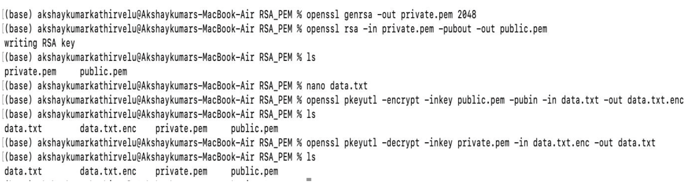

# Lab 02 — RSA Public/Private Key Cryptography

**Algorithm:** RSA-2048
**Tool:** OpenSSL (macOS terminal)
**Files included:** `public.pem`, `private.pem`, `data.txt.enc`

---

## What's in This Directory

| File | Description |
|---|---|
| `public.pem` | 2048-bit RSA public key — safe to share |
| `private.pem` | RSA private key — corresponds to `public.pem` |
| `data.txt.enc` | A message encrypted with `public.pem` |
| `assets/terminal-session.png` | Full terminal session showing every command run |

These are real keys generated for this lab — not placeholders or screenshots of someone else's work. The full command history is shown in the terminal screenshot below. You can run the decryption command yourself with the files in this repo.

---

## Full Terminal Session

The screenshot below shows the complete workflow from key generation through encryption and decryption, run on my MacBook Air.



---

## Commands Run — Step by Step

### Step 1: Generate a 2048-bit RSA private key

```bash
openssl genrsa -out private.pem 2048
```

Generates a 2048-bit RSA private key and saves it to `private.pem`. The key contains both the private exponent and the public modulus — everything needed to derive the public key.

---

### Step 2: Extract the public key

```bash
openssl rsa -in private.pem -pubout -out public.pem
# Output: writing RSA key
```

Extracts just the public component from `private.pem` and writes it to `public.pem`. The "writing RSA key" confirmation confirms the extraction succeeded. At this point `ls` shows both files:

```
private.pem    public.pem
```

---

### Step 3: Create the plaintext message

```bash
nano data.txt
```

Opened `nano` and typed the message to be encrypted. The plaintext is `Hello Professor`.

---

### Step 4: Encrypt the message with the public key

```bash
openssl pkeyutl -encrypt -inkey public.pem -pubin -in data.txt -out data.txt.enc
```

Encrypts `data.txt` using the public key (`-pubin` flag tells OpenSSL the key file is a public key). The encrypted output is written to `data.txt.enc`. Now `ls` shows three files:

```
data.txt    data.txt.enc    private.pem
```

`data.txt.enc` is 256 bytes — the RSA block size for a 2048-bit key. The original "Hello Professor" plaintext is now unreadable without the private key.

---

### Step 5: Decrypt with the private key

```bash
openssl pkeyutl -decrypt -inkey private.pem -in data.txt.enc -out data.txt
```

Decrypts `data.txt.enc` using `private.pem` and writes the result back to `data.txt`. Final `ls` confirms all four files are present:

```
data.txt    data.txt.enc    private.pem    public.pem
```

The decrypted `data.txt` contains: **`Hello Professor`** [attached the generated public key and the encrypted message data.txt.enc file. Decrypted and verified the data.txt.enc file with the private key private.pem, it returns the message “Hello Professor”.]

---

## Verifying It Yourself

```bash
# Clone or download this repo, then run:
openssl pkeyutl -decrypt -inkey private.pem -in data.txt.enc

# Expected output:
# Hello Professor
```

---

## How RSA Works

The keypair has a mathematical relationship: the private key contains two large primes `p` and `q`, and the public modulus `n = p × q`. Encryption with the public key can only be reversed by someone who knows `p` and `q` — which is embedded in the private key. Factoring `n` back into `p` and `q` for a 2048-bit key is computationally infeasible with current classical hardware.

This asymmetry — anyone can encrypt, only the private key holder can decrypt — is what makes RSA foundational to:
- **TLS/HTTPS** — key exchange at the start of every encrypted web session
- **SSH** — public key authentication (your `~/.ssh/id_rsa.pub` is a public key)
- **Code signing** — verifying that software came from a trusted publisher
- **Email encryption** — PGP/GPG uses RSA for key pairs

---

## Key Management Notes

> ⚠️ These keys were generated for this educational exercise only. In any real deployment:

- **Never commit private keys to a public repo** — use a secrets manager (HashiCorp Vault, AWS KMS) or HSM
- **Key rotation** — RSA keys should be rotated on a defined schedule
- **Minimum key size** — 2048-bit is the current floor; NIST recommends 3072-bit or migrating to elliptic curve (Ed25519) for equivalent security with shorter keys
- **Post-quantum** — RSA is vulnerable to Shor's algorithm on a quantum computer. NIST finalized Post-Quantum Cryptography standards in 2024 (ML-KEM, ML-DSA) as replacements

---

## Screenshot Guide

> Add your screenshot to `assets/` with this filename:

| Filename | What it should show |
|---|---|
| `terminal-session.png` | The full terminal window from your PDF — all commands from `openssl genrsa` through the final `ls` showing all four files |
